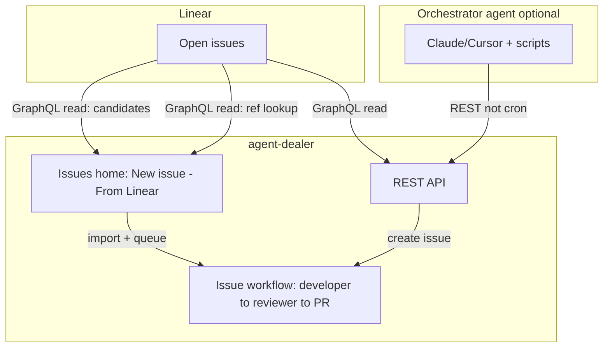

# Linear integration

Linear is the primary intake path for agent-dealer. On the Issues home, **New issue → From Linear** lists **open** team issues (Backlog / Todo / In Progress / In Review by default) as candidates, or takes a pasted `NOT-xx` id / Linear URL via lookup. Importing one creates a dealer issue from the Linear fields and queues it for the developer → reviewer workflow.

**Manual issue creation** sits alongside it in the same form.

> **Changed in NOT-71.** The standalone Inbox page, promotion into an Operations lifecycle, and the plan-approval gate are gone along with the plan/execute product. Intake is now one form on the Issues home, and the only Linear surfaces left are the candidate list and the ref lookup.

## Architecture



## Principles

| Topic | Behavior |
|-------|----------|
| **Intake** | Human or agent imports issues one at a time — no server auto-cron enqueue |
| **Linear read** | Server GraphQL (`linear-inbox.ts`) — not Agent Deck MCP for the queue |
| **API key** | `LINEAR_API_KEY` env-only — never stored in SQLite |
| **Settings** | Filters in SQLite, seeded with defaults; `LINEAR_STATE_FILTER` / `LINEAR_TEAM_ID` env override saved values when set. No UI edits them since NOT-71 removed the Inbox settings panel |
| **Automation** | REST API first; orchestrator agents create issues directly |
| **Write-back** | Non-blocking comment + status, but only on the run-scoped delivery `done` path — see [Status write-back](#status-write-back) |

## Configuration

### Environment (secrets + live filter overrides)

| Variable | Role |
|----------|------|
| `LINEAR_API_KEY` | Required for Linear API (Personal API key) |
| `LINEAR_STATE_FILTER` | **Live override** when set — inbox uses this instead of saved filter |
| `LINEAR_TEAM_ID` | **Live override** when set — inbox uses this instead of saved team |
| `AGENT_DEALER_WEB_URL` | Optional — links in Linear comments (dev default `http://localhost:3222`, prod `http://localhost:2222`) |

### Persisted settings (`intake_settings`)

| Key | Default | Notes |
|-----|---------|-------|
| `linear.stateFilter` | `["Backlog","Todo","In Progress","In Review"]` | Saved filter; overridden by `LINEAR_STATE_FILTER` env when set |
| `linear.teamId` | null | Saved team; overridden by `LINEAR_TEAM_ID` env when set |
| `linear.assigneeMe` | false | When true, filter to API key owner |
| `linear.defaultAgentId` | null | **Unused since NOT-71** — the routing that read it is deleted |
| `linear.syncEnabled` | true | Master toggle for write-back |
| `linear.routingRules` | `[]` | **Unused since NOT-71** — `autoAgent` label routing is deleted |

These are read from SQLite (and overridden by env where noted). NOT-71 removed the settings UI and its `PATCH` route, so changing a saved value now means editing `intake_settings` directly or setting the env override.

## Workflow

1. **Find** — Open-state issues matching the saved filters (default: Backlog, Todo, In Progress, In Review; **not** limited to assignee) appear as candidates under **New issue → From Linear**. The same form also accepts a free-form `NOT-xx` or a Linear URL via lookup. Optional "assigned to me" lives in the persisted settings.
2. **Import** — Title, description and any Acceptance criteria section are pulled from the Linear issue; you pick repo, base branch, developer and reviewer, and it is queued by default.
3. **Run** — The issue coordinator takes it from the queue: developer session → reviewer session → PR, with human actions raised on the Issues home when something needs a decision.

Re-importing a Linear issue that is already present is idempotent: rather than creating a duplicate, it re-enqueues the existing issue when that issue is in a state admission can start.

### Status write-back

> **By design since NOT-71.** Dealer does not write issue status back to Linear. Linear's
> own **GitHub integration** links the PR to the issue (it attaches PR #59 to NOT-71, for
> example) and drives issue state from the PR lifecycle, so a second writer here would
> fight it. `LinearSyncEvent` is therefore narrowed to the one event that still fires:
> `done`, from `queue/approve-deliver.ts` on the run-scoped outbound-delivery approval.

When it does fire (and `syncEnabled`), it posts a non-blocking comment and sets status:

| agent-dealer event | Linear status | Fired by |
|--------------------|---------------|----------|
| `done` | **Done** | `queue/approve-deliver.ts` — outbound delivery approval |

Issue-workflow status (In Progress / In Review / Done as the PR opens, reviews and merges)
comes from Linear's GitHub integration, not from here.

> **TODO (P2):** Make this event → Linear status mapping **configurable per team** (`linear.statusMap` in intake config). It hardcodes names in `packages/server/src/adapters/linear-sync.ts` (`STATE_BY_EVENT`) and resolves workflow states case-insensitively against the issue's Linear team.

## Dependency readiness (NOT-104)

A Linear-sourced issue waits in the admission queue while its **declared** blockers are
unsatisfied, so a dependent never branches from a base that is missing its upstream work.
Dealer never infers a dependency — the only edge it reads is an explicit `blocks` relation a
human wrote in Linear (`related`, `duplicate` and the parent/sub-issue hierarchy are ignored,
so an open epic does not block its own children).

| Topic | Behavior |
|-------|----------|
| **Satisfied** | Blocker also kicked into dealer → dealer `done` (the PR actually merged). Not in dealer → Linear state type `completed` or `canceled` |
| **Reason** | The queue entry shows `waiting on NOT-123 (In Progress)`, or `dependency state unavailable` when Linear can't be read |
| **Fetch** | One batched, timeout-bounded GraphQL query per admission tick that has a free slot, cached ~60s; a busy system makes no Linear calls |
| **Outage** | No `LINEAR_API_KEY` / Linear down → Linear-sourced issues **park** (stay `queued`, never dropped) and resume on the next successful fetch. Manual issues keep running |
| **Escape hatch** | Edit Linear: remove the relation, or mark an abandoned blocker that dealer never picked up `canceled`. A blocker already in dealer releases only at dealer `done`, so drop its relation. There is no per-issue bypass flag |

Cycles are not detected: two issues blocking each other both park naming the other, and the
operator fixes the relation in Linear.

## API-key budget & observability (NOT-152 / NOT-159)

Linear's **personal API key** limit is **2,500 requests / user / hour** (all keys for that
user share one bucket). An **OAuth app** (e.g. Agent Deck's Linear MCP) has a **separate**
5,000 req / user / app / hour bucket — do not blame MCP traffic for dealer `LINEAR_API_KEY`
exhaustion without evidence. See [Linear rate limiting](https://linear.app/developers/rate-limiting).

Response headers of interest (on every GraphQL POST):

| Header | Meaning |
|--------|---------|
| `X-RateLimit-Requests-Limit` | Usually `2500` for API keys |
| `X-RateLimit-Requests-Remaining` | Requests left in the current hour window |
| `X-RateLimit-Requests-Reset` | UTC epoch **milliseconds** when the window resets |
| `X-RateLimit-Complexity-*` | Separate complexity budget (rarely the binding limit) |

### Steady-state cost (dealer)

| Path | Operation name(s) | Expected rate |
|------|-------------------|---------------|
| Admission blockers (NOT-104) | `fetchLinearBlockers`, `fetchLinearBlockersPage` | ≤ ~1 req / 60s when a free slot exists and Linear-sourced issues are queued (TTL cache). **Zero** when capacity is full or the queue has no Linear issues |
| Inbox "From Linear" | `getLinearViewer`, `listLinearCandidates` (+ pages of 50) | Burst on each open of the candidate list — **uncached** |
| Kick lookup | `getLinearIssue` | One per lookup |
| Delivery sync | `getLinearIssue`, `getWorkflowStates`, `commentCreate`, `issueUpdateState` | Few per approved delivery |

A healthy overnight run with a non-empty Linear queue should be on the order of **tens to low hundreds** of API-key requests per hour from dealer alone — not thousands. If `remaining` hits 0, something else on the same key (another dealer home, scripts, tools) or a bug is amplifying calls.

### Reading live counters

Process-lifetime counters (no env flag required). Examples below use the **bundled**
production port (`agent-dealer start --daemon` → API + UI on **2222**). Split API-only
listen ports are prod **2221** / dev **3221** — see [PROD_SETUP.md](PROD_SETUP.md).

```bash
curl -s http://127.0.0.1:2222/api/debug/linear-usage | jq
```

Fields: `totalOk` / `totalError`, `byOperation` (`ok`/`error` per GraphQL operation name),
`lastRateLimit` (last observed headers), `since` / `lastAt`. Counters reset on process restart.

Server also emits a `[linear-usage]` summary line about once per minute when traffic > 0
since the previous line. For every call (verbose): `AGENT_DEALER_LINEAR_TRACE=1`.

## REST API (orchestrator agents)

**Base URL** (same port rule as above):

| How you run dealer | API base |
|--------------------|----------|
| Bundled install (`agent-dealer start --daemon`) | `http://127.0.0.1:2222` |
| Git prod (`npm run start`) | `http://127.0.0.1:2221` |
| Dev (`npm run dev`) | `http://127.0.0.1:3221` |

Curl examples in this section use **2222** (bundled). Substitute `2221` / `3221` when you run a split API. See [PROD_SETUP.md](PROD_SETUP.md).

### Connection & config

```bash
# Connection test (viewer from API key)
curl -s http://127.0.0.1:2222/api/intake/linear/status | jq

# Read config (non-secret)
curl -s http://127.0.0.1:2222/api/intake/linear/config | jq

# Update filters (open-state default; assigneeMe optional)
curl -s -X PATCH http://127.0.0.1:2222/api/intake/linear/config \
  -H 'Content-Type: application/json' \
  -d '{"stateFilter":["Backlog","Todo","In Progress","In Review"],"assigneeMe":false,"syncEnabled":true}' | jq
```

### List candidates

```bash
curl -s http://127.0.0.1:2222/api/intake/linear | jq '.candidates[] | {id, identifier, title}'
```

### Free-form lookup (kick)

Resolve a Linear identifier or issue URL without relying on the inbox list (also used by Issues → From Linear → Lookup):

```bash
curl -s 'http://127.0.0.1:2222/api/intake/linear/lookup?q=NOT-103' | jq '.candidate | {id, identifier, title}'
# q also accepts a Linear issue URL or UUID
```

> **Removed in NOT-71.** `POST /api/intake/linear/:issueId/promote` and
> `POST /api/intake/linear/:issueId/resolve-agent` are gone, along with the label-based
> `autoAgent` routing behind them (`intake/agent-routing.ts`). They promoted a Linear issue
> into a plan/execute run, which no longer exists. Import a Linear issue from the Issues
> home instead, or create it through the issues API and let the queue admit it.

## Future MCP tool shapes (spec only)

No agent-dealer MCP server in this pass. Orchestrator agents may wrap REST as:

| Tool | Maps to |
|------|---------|
| `list_linear_candidates` | `GET /api/intake/linear` |
| `lookup_linear_issue` | `GET /api/intake/linear/lookup?q=` |

## Out of scope

- Server-side auto-cron enqueue (Phase D)
- agent-dealer MCP server binary
- LLM-based agent creation

## Related docs

- [Agent profiles](AGENT_PROFILES.md) — workspace binding for issue workers
- [Data model](DATA_MODEL.md) — runs, artifacts, `external_label`
