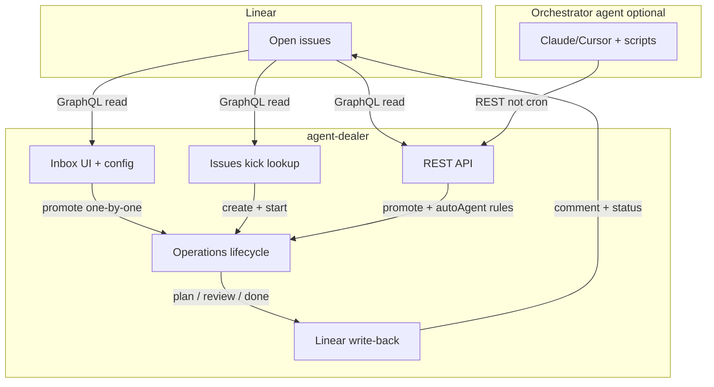

# Linear integration

Linear is the primary intake path for agent-dealer: **open** team issues (Backlog / Todo / In Progress / In Review by default) appear in the **Inbox**; you promote them one-by-one into **Operations**, approve the plan, and the agent executes with human gates preserved. Optionally filter to “assigned to me” in Inbox settings. On Issues kick (**From Linear**), you can also paste a `NOT-xx` id or Linear URL to look up any issue without relying on the inbox list.

**Manual tasks** remain for testing; they are not the main workflow.

## Architecture



## Principles

| Topic | Behavior |
|-------|----------|
| **Intake** | Human or agent promotes issues — no server auto-cron enqueue |
| **Linear read** | Server GraphQL (`linear-inbox.ts`) — not Agent Deck MCP for the queue |
| **API key** | `LINEAR_API_KEY` env-only — never stored in SQLite |
| **Settings** | Filters in SQLite; editable in Inbox → Linear settings. `LINEAR_STATE_FILTER` / `LINEAR_TEAM_ID` env override saved values when set |
| **Automation** | REST API first; orchestrator agents call promote/resolve-agent |
| **Write-back** | Non-blocking comments + status at plan / review / done milestones |

## Configuration

### Environment (secrets + live filter overrides)

| Variable | Role |
|----------|------|
| `LINEAR_API_KEY` | Required for Linear API (Personal API key) |
| `LINEAR_STATE_FILTER` | **Live override** when set — inbox uses this instead of saved filter |
| `LINEAR_TEAM_ID` | **Live override** when set — inbox uses this instead of saved team |
| `AGENT_DEALER_WEB_URL` | Optional — links in Linear comments (dev default `http://localhost:3222`, prod `http://localhost:2222`) |

### Persisted settings (`intake_settings`)

| Key | Default | Notes |
|-----|---------|-------|
| `linear.stateFilter` | `["Backlog","Todo","In Progress","In Review"]` | Saved filter; overridden by `LINEAR_STATE_FILTER` env when set |
| `linear.teamId` | null | Saved team; overridden by `LINEAR_TEAM_ID` env when set |
| `linear.assigneeMe` | false | When true, filter to API key owner |
| `linear.defaultAgentId` | null | Pre-select in Inbox UI |
| `linear.syncEnabled` | true | Master toggle for write-back |
| `linear.routingRules` | `[]` | Label → agentId rules for `autoAgent` |

Configure via **Inbox → Linear settings** or `PATCH /api/intake/linear/config`.

## Workflow

Linear issue status write-back (when `syncEnabled`):

| agent-dealer event | Linear status |
|--------------------|---------------|
| Agent starts planning | **Todo** (e.g. Backlog → Todo) |
| Plan approved | **In Progress** |
| Execution complete (review gate) | **In Review** |
| Retry with feedback | **In Progress** |
| Human approves done | **Done** |

> **TODO (P2):** Make this event → Linear status mapping **configurable per team** (Inbox settings or `linear.statusMap` in intake config). v0 hardcodes names in `packages/server/src/adapters/linear-sync.ts` (`STATE_BY_EVENT`) and resolves workflow states case-insensitively against the issue’s Linear team.

1. **Inbox / kick** — Open-state issues matching filters (default: Backlog, Todo, In Progress, In Review; **not** limited to assignee) appear as candidates. Issues kick also accepts free-form `NOT-xx` or a Linear URL via lookup. Optional “assigned to me” stays in settings.
2. **Promote / create** — Inbox: pick agent → **Kick plan** → run enters Operations at `plan_pending`. Issues kick: create issue from Linear fields + start when acceptance criteria are present.
3. **Planning** — When the agent actually starts drafting → Linear comment + status **Todo**.
4. **Plan gate** — Review draft → **Approve plan** → Linear comment + status **In Progress**.
5. **Execute** — Agent runs → transitions to **review** → Linear comment + status **In Review**.
6. **Done** — **Approve done** → Linear comment + status **Done**.
7. **Retry** — Re-executes with feedback (same approved plan) → Linear comment + status **In Progress** → **Review Result** when done.

Promote is blocked (409) if an active run already exists for the same Linear issue (`source=linear`, `external_id=issue.id`).

## Dependency readiness (NOT-104)

A Linear-sourced issue waits in the admission queue while its **declared** blockers are
unsatisfied, so a dependent never branches from a base that is missing its upstream work.
Dealer never infers a dependency — the only edge it reads is an explicit `blocks` relation a
human wrote in Linear (`related`, `duplicate` and the parent/sub-issue hierarchy are ignored,
so an open epic does not block its own children).

| Topic | Behavior |
|-------|----------|
| **Satisfied** | Blocker also kicked into dealer → dealer `done` (the PR actually merged). Not in dealer → Linear state type `completed` or `canceled` |
| **Reason** | The queue entry shows `waiting on NOT-123 (In Progress)`, or `dependency state unavailable` when Linear can't be read |
| **Fetch** | One batched, timeout-bounded GraphQL query per admission tick that has a free slot, cached ~60s; a busy system makes no Linear calls |
| **Outage** | No `LINEAR_API_KEY` / Linear down → Linear-sourced issues **park** (stay `queued`, never dropped) and resume on the next successful fetch. Manual issues keep running |
| **Escape hatch** | Edit Linear: remove the relation, or mark an abandoned blocker `canceled`. There is no per-issue bypass flag |

Cycles are not detected: two issues blocking each other both park naming the other, and the
operator fixes the relation in Linear.

## REST API (orchestrator agents)

Base URL: `http://127.0.0.1:3221` (development) or `http://127.0.0.1:2221` (production). See [PROD_SETUP.md](PROD_SETUP.md).

### Connection & config

```bash
# Connection test (viewer from API key)
curl -s http://127.0.0.1:2221/api/intake/linear/status | jq

# Read config (non-secret)
curl -s http://127.0.0.1:2221/api/intake/linear/config | jq

# Update filters (open-state default; assigneeMe optional)
curl -s -X PATCH http://127.0.0.1:2221/api/intake/linear/config \
  -H 'Content-Type: application/json' \
  -d '{"stateFilter":["Backlog","Todo","In Progress","In Review"],"assigneeMe":false,"syncEnabled":true}' | jq
```

### List inbox

```bash
curl -s http://127.0.0.1:2221/api/intake/linear | jq '.candidates[] | {id, identifier, title}'
```

### Free-form lookup (kick)

Resolve a Linear identifier or issue URL without relying on the inbox list (also used by Issues → From Linear → Lookup):

```bash
curl -s 'http://127.0.0.1:2221/api/intake/linear/lookup?q=NOT-103' | jq '.candidate | {id, identifier, title}'
# q also accepts a Linear issue URL or UUID
```

### Resolve agent (preview routing)

```bash
curl -s -X POST http://127.0.0.1:2221/api/intake/linear/ISSUE_UUID/resolve-agent | jq
# → { "agentId": "...", "reason": "label:content → Notes agent" }
```

Routing order: explicit `agentId` on promote → label rules → `defaultAgentId` → first healthy agent with workspace.

### Promote issue

```bash
# Explicit agent
curl -s -X POST http://127.0.0.1:2221/api/intake/linear/ISSUE_UUID/promote \
  -H 'Content-Type: application/json' \
  -d '{"agentId":"AGENT_UUID"}' | jq

# Auto-resolve agent
curl -s -X POST http://127.0.0.1:2221/api/intake/linear/ISSUE_UUID/promote \
  -H 'Content-Type: application/json' \
  -d '{"autoAgent":true}' | jq
```

Requires exactly one of `agentId` or `autoAgent: true`.

## Future MCP tool shapes (spec only)

No agent-dealer MCP server in this pass. Orchestrator agents may wrap REST as:

| Tool | Maps to |
|------|---------|
| `list_linear_inbox` | `GET /api/intake/linear` |
| `lookup_linear_issue` | `GET /api/intake/linear/lookup?q=` |
| `promote_issue` | `POST /api/intake/linear/:issueId/promote` |
| `resolve_agent` | `POST /api/intake/linear/:issueId/resolve-agent` |

## Out of scope

- Server-side auto-cron enqueue (Phase D)
- agent-dealer MCP server binary
- LLM-based agent creation

## Related docs

- [Agent profiles](AGENT_PROFILES.md) — workspace binding for promoted runs
- [Data model](DATA_MODEL.md) — runs, artifacts, `external_label`
