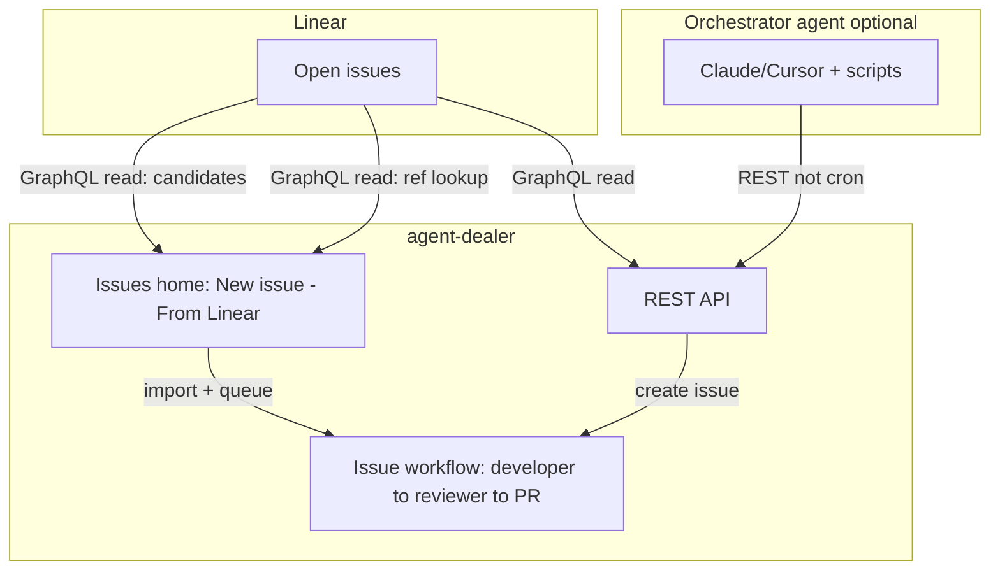

# Linear integration

Linear is the primary intake path for agent-dealer. On the Issues home, **New issue → From Linear** lists **open** team issues (Backlog / Todo / In Progress / In Review by default) as candidates, or takes a pasted `NOT-xx` id / Linear URL via lookup. Importing one creates a dealer issue from the Linear fields and queues it for the developer → reviewer workflow.

**Manual issue creation** sits alongside it in the same form.

> **Changed in NOT-71.** The standalone Inbox page, promotion into an Operations lifecycle, and the plan-approval gate are gone along with the plan/execute product. Intake is now one form on the Issues home, and the only Linear surfaces left are the candidate list and the ref lookup.

## Architecture


```mermaid
flowchart TB
  subgraph linear [Linear]
    Issues[Open issues]
  end
  subgraph dealer [agent-dealer]
    NewIssue[Issues home: New issue - From Linear]
    API[REST API]
    Workflow[Issue workflow: developer to reviewer to PR]
  end
  subgraph agent [Orchestrator agent optional]
    AgentCLI[Claude/Cursor + scripts]
  end
  Issues -->|GraphQL read: candidates| NewIssue
  Issues -->|GraphQL read: ref lookup| NewIssue
  Issues -->|GraphQL read| API
  NewIssue -->|import + queue| Workflow
  AgentCLI -->|REST not cron| API
  API -->|create issue| Workflow
```

## Principles

| Topic | Behavior |
|-------|----------|
| **Intake** | Human or agent imports issues one at a time — no server auto-cron enqueue |
| **Linear read** | Server GraphQL (`linear-inbox.ts`) — not Agent Deck MCP for the queue |
| **API key** | `LINEAR_API_KEY` env-only — never stored in SQLite |
| **Settings** | Filters in SQLite, seeded with defaults; `LINEAR_STATE_FILTER` / `LINEAR_TEAM_ID` env override saved values when set. Edit Team / Assignee / Status from **New issue → From Linear** (gear beside the open-inbox picker) — NOT-361; no global Configuration page |
| **Automation** | REST API first; orchestrator agents create issues directly |
| **Write-back** | Status comes from Linear's GitHub integration; Dealer verifies it post-merge and only then falls back to one completed-state write — see [Status write-back](#status-write-back) |

## Configuration

### Environment (secrets + live filter overrides)

| Variable | Role |
|----------|------|
| `LINEAR_API_KEY` | Required for Linear API (Personal API key) |
| `LINEAR_STATE_FILTER` | **Live override** when set — candidate list uses this instead of saved filter |
| `LINEAR_TEAM_ID` | **Live override** when set — candidate list uses this instead of saved team |
| `AGENT_DEALER_WEB_URL` | Optional — links in Linear comments (dev default `http://localhost:3222`, prod `http://localhost:2222`) |

### Persisted settings (`intake_settings`)

| Key | Default | Notes |
|-----|---------|-------|
| `linear.stateFilter` | `["Backlog","Todo","In Progress","In Review"]` | Saved filter; overridden by `LINEAR_STATE_FILTER` env when set |
| `linear.teamId` | null | Saved team; overridden by `LINEAR_TEAM_ID` env when set |
| `linear.assigneeMe` | false | When true, filter to API key owner |
| `linear.defaultAgentId` | null | **Unused since NOT-71** — the routing that read it is deleted |
| `linear.syncEnabled` | true | Master toggle for write-back |
| `linear.routingRules` | `[]` | **Unused since NOT-71** — `autoAgent` label routing is deleted |

These are read from SQLite (and overridden by env where noted). **NOT-361** restores a narrow picker config API and an inline editor on **New issue → From Linear**:

| Endpoint | Role |
|----------|------|
| `GET` / `PATCH /api/intake/linear/config` | Effective + persisted Team / Assignee / Status; env override flags |
| `GET /api/intake/linear/metadata` | Team names/IDs, workflow status names, authenticated Linear viewer |
| `GET /api/intake/linear` | At most **50** most-recently-updated candidates + `hasMore` (no cursor walk) |

Exact identifier/URL lookup (`GET /api/intake/linear/lookup`) ignores saved picker filters. Env overrides remain authoritative: the UI disables only the overridden controls and explains why.

## Workflow

1. **Find** — Open-state issues matching the saved filters (default: Backlog, Todo, In Progress, In Review; **not** limited to assignee) appear as candidates under **New issue → From Linear** (most recently updated first, capped at 50). Use the gear beside the open-inbox picker to change Team / Assignee / Status. The same form also accepts a free-form `NOT-xx` or a Linear URL via lookup (works even when the issue is outside the picker filters).
2. **Import** — Title, description and any Acceptance criteria section are pulled from the Linear issue; you pick repo, base branch, developer and reviewer, and it is queued by default.
3. **Run** — The issue coordinator takes it from the queue: developer session → reviewer session → PR, with human actions raised on the Issues home when something needs a decision.

Re-importing a Linear issue that is already present is idempotent: rather than creating a duplicate, it re-enqueues the existing issue when that issue is in a state admission can start.

4. **Refine before execution (NOT-363)** — While the issue is still `ready` with no active workflow or running worker, the Issue Detail offers **Reload from Linear** (Linear-sourced issues only) and **Edit title / description / acceptance criteria** (every pre-execution `ready` issue, even when readiness already passes). Reload pulls the latest ticket title/description through the same adapter and title convention as import (`<identifier>: <title>`), recompiles the execution contract, and replaces the acceptance criteria with the freshly derived ones — old local criteria never survive a reload. Repository, agents, policy limits, auto-merge, and queue position are unchanged, and nothing is written back to Linear. Once execution owns the snapshot (admitted/running), both paths refuse with 409. Dealer never polls Linear after import; attachments are not imported.

### Repository labels (NOT-251; replaces the NOT-242 confirmation flow)

A Linear issue declares its GitHub repository with an explicit reusable label
that carries the canonical identity directly:

```text
repo:github.com/<owner>/<repo>
```

`repo:github.com/not-so-fat/agent-dealer`, for example. Dealer reads only
labels whose name starts with `repo:` (prefix match is case-insensitive) and
normalizes the remainder through the same shared parser as a manually entered
repository, so the two can never drift. It never infers a repository from
ordinary product labels (even one like `agent-dealer`), ticket text, team,
title, recent history, or an Agent profile — those shortcuts are exactly the
mistake this flow prevents.

The New issue form has exactly one ordinary repository input — required and
editable like every other field. There is no confirmation button, summary
row, or override mode. The label acts as an auto-fill hint:

| Labels on the issue | What the New issue form does |
|---------------------|------------------------------|
| Exactly one valid `repo:` label | Silently pre-fills the input with the normalized repository — no banner, no extra UI |
| No `repo:` label | Preserves the repository already in the input; if empty, type or pick a recent repository in the same control |
| More than one `repo:` label | Keeps the current repository and shows a compact inline warning naming every conflicting label; never picks first |
| Invalid / non-GitHub value | Keeps the current repository and shows a compact inline warning with the bad label and the reason |

Fallback, plainly: no usable label preserves the ordinary repository input,
and you overwrite it directly when needed. Switching tickets or switching
between Manual and From Linear never clears a valid repository — only a new
ticket with exactly one valid `repo:` label intentionally replaces it. A
valid manually entered repository is always submittable; a label problem is
never a second gate. **Kick from Linear** (and manual Create) submit as soon
as title, a valid repository, developer, and reviewer are present.

Dealer never creates or mutates Linear labels — it only reads and validates
them, and never writes them back. See
[Production setup](PROD_SETUP.md) for the one-time Linear label, template,
and Triage Rule setup that automates the input.

### Repository mappings (NOT-260)

An operator can use a normal Linear label such as `agent-dealer` and teach
Dealer what repository it means, without putting the repository identity in
the label itself:

1. Open **New issue** → click the gear beside the **Repository** control.
2. Save `agent-dealer` → `github.com/not-so-fat/agent-dealer`.
3. Apply the `agent-dealer` label in Linear.
4. Look up the issue (candidate list or direct lookup); Dealer fills the
   Repository default with the mapped repository.
5. Override through **Recent repositories** or free-form entry when needed —
   selecting a recent repository or typing/pasting another GitHub URL or
   `owner/repo` replaces the mapped default immediately, and the submitted
   repository is the one stored on the Dealer issue.

Rules:

- A normalized label (trimmed, case-insensitive) is a unique key: one label
  points to exactly one repository, and saving a new repository for an
  existing label overwrites it. Different labels may point to the same
  repository.
- A resolved mapping supplies only the default for the current New issue
  form — it never locks the field and adds no confirmation step.
- Later mapping edits affect future Linear lookups only; they never rewrite
  repositories already stored on Dealer issues.
- Legacy `repo:github.com/owner/repo` labels remain a fallback only when no
  configured mapping matches. When several matched labels point at different
  repositories the candidate conflicts and the current Repository value is
  kept; when they agree on one repository it resolves.

### Status write-back

> **Changed in NOT-362.** Dealer still does not write issue status as the PR
> lifecycle runs — Linear's own **GitHub integration** links the PR to the
> issue and drives issue state from it, so a second writer there would fight
> it. But Dealer no longer trusts that delegation blindly: after the
> coordinator's terminal merged transition for a `source = linear` issue, it
> re-reads the Linear issue and confirms it advanced, and every outcome is
> recorded as an artifact on the Dealer issue.

**The check** (`coordinator/linear-merge-verify.ts`, bounded retry window so the
integration has time to act): the Linear issue counts as advanced when either
its state type left `backlog`/`unstarted`, or its attachments contain the
merged PR URL.

**The conditional fallback:** when the check still sees a stale issue and
`linear.syncEnabled` is true, Dealer writes the issue to the team's completed
state and posts the Dealer comment — reusing `syncLinearForRun`'s state
resolution (`linear-sync.ts`), never a second writer. It fires only after the
integration has demonstrably not acted, so it never races a working
integration, and it writes at most once per issue (a recorded fallback guards
re-runs).

**The human action:** when the fallback is unavailable or itself fails (no API
write access, no matching completed state), Dealer raises one open
`policy_escalation` on the Issues home naming the Linear identifier, the
merged PR URL, and the observed state (idempotent re-raise by stable request
id). The Dealer issue itself stays `done` — the action is a notice, not a gate.
It resolves from the Issues home via **Acknowledge**, or **Re-check Linear**
after advancing the issue by hand (the re-check re-reads Linear and records a
fresh verification artifact, clearing the notice when the issue now verifies).

The check runs fire-and-forget off every `done` landing, so the bounded retry
window never holds the merge caller.

The run-scoped delivery path is unchanged:

| agent-dealer event | Linear status | Fired by |
|--------------------|---------------|----------|
| `done` | **Done** | `queue/approve-deliver.ts` — outbound delivery approval |

> **TODO (P2):** Make this event → Linear status mapping **configurable per team** (`linear.statusMap` in intake config). It hardcodes names in `packages/server/src/adapters/linear-sync.ts` (`STATE_BY_EVENT`) and resolves workflow states case-insensitively against the issue's Linear team.

## Dependency readiness (NOT-104)

A Linear-sourced issue waits in the admission queue while its **declared** blockers are
unsatisfied, so a dependent never branches from a base that is missing its upstream work.
Dealer never infers a dependency — the only edge it reads is an explicit `blocks` relation a
human wrote in Linear (`related`, `duplicate` and the parent/sub-issue hierarchy are ignored,
so an open epic does not block its own children).

| Topic | Behavior |
|-------|----------|
| **Satisfied** | Blocker also kicked into dealer → dealer `done` (the PR actually merged). Not in dealer → Linear state type `completed` or `canceled` |
| **Reason** | The queue entry shows `waiting on NOT-123 (In Progress)`, or, when Linear can't be read, the cause: `Linear rate limited — retry ~21:57 local (requests-remaining=0, resets <ISO time>)`, `Linear timed out …`, `LINEAR_API_KEY not set …`, `Linear HTTP <status> …`, `Linear fetch failed …` (bare `dependency state unavailable` when Linear answered but omitted the issue). Start never bypasses it |
| **Fetch** | One batched, timeout-bounded GraphQL query per admission tick that has a free slot, cached ~60s; a busy system makes no Linear calls |
| **Outage** | No `LINEAR_API_KEY` / Linear down → Linear-sourced issues **park** (stay `queued`, never dropped) and resume on the next successful fetch. Manual issues keep running |
| **Escape hatch** | Edit Linear: remove the relation, or mark an abandoned blocker that dealer never picked up `canceled`. A blocker already in dealer releases only at dealer `done`, so drop its relation. There is no per-issue bypass flag |

Cycles are not detected: two issues blocking each other both park naming the other, and the
operator fixes the relation in Linear.

## API-key budget & observability (NOT-152 / NOT-159)

Linear's **personal API key** limit is **2,500 requests / user / hour** (all keys for that
user share one bucket). An **OAuth app** (e.g. Agent Deck's Linear MCP) has a **separate**
5,000 req / user / app / hour bucket — do not blame MCP traffic for dealer `LINEAR_API_KEY`
exhaustion without evidence. See [Linear rate limiting](https://linear.app/developers/rate-limiting).

Response headers of interest (on every GraphQL POST):

| Header | Meaning |
|--------|---------|
| `X-RateLimit-Requests-Limit` | Usually `2500` for API keys |
| `X-RateLimit-Requests-Remaining` | Requests left in the current hour window |
| `X-RateLimit-Requests-Reset` | UTC epoch **milliseconds** when the window resets |
| `X-RateLimit-Complexity-*` | Separate complexity budget (rarely the binding limit) |

### Steady-state cost (dealer)

| Path | Operation name(s) | Expected rate |
|------|-------------------|---------------|
| Admission blockers (NOT-104) | `fetchLinearBlockers`, `fetchLinearBlockersPage` | ≤ ~1 req / 60s when a free slot exists and Linear-sourced issues are queued (TTL cache). **Zero** when capacity is full or the queue has no Linear issues |
| From Linear (candidate list) | `listLinearCandidates` (single page of ≤50, `orderBy: updatedAt`); `getLinearViewer` only when `linear.assigneeMe` is true | Burst on each open — **uncached** |
| From Linear (filter editor) | `fetchLinearIntakeMetadata` (teams + states + viewer); config via SQLite | On editor open / save |
| Kick lookup | `getLinearIssue` | One per lookup |
| Delivery sync | `getLinearIssue`, `getWorkflowStates`, `commentCreate`, `issueUpdateState` | Few per approved delivery |
| Post-merge verify (NOT-362) | `readLinearPostMergeState` (≤3 reads); fallback reuses `getWorkflowStates`, `commentCreate`, `issueUpdateState` at most once per issue | Few per merged Linear issue |

A healthy overnight run with a non-empty Linear queue should be on the order of **tens to low hundreds** of API-key requests per hour from dealer alone — not thousands. If `remaining` hits 0, something else on the same key (another dealer home, scripts, tools) or a bug is amplifying calls.

### Reading live counters

Process-lifetime counters (no env flag required). Examples below use the **bundled**
production port (`agent-dealer start --daemon` → API + UI on **2222**). Split API-only
listen ports are prod **2221** / dev **3221** — see [PROD_SETUP.md](PROD_SETUP.md).

```bash
curl -s http://127.0.0.1:2222/api/debug/linear-usage | jq
```

Fields: `totalOk` / `totalError`, `byOperation` (`ok`/`error` per GraphQL operation name),
`lastRateLimit` (last observed headers), `since` / `lastAt`, `logPath`. In-memory counters
reset on process restart; the durable log does not.

Every GraphQL call (and each minute summary / boot) is appended as JSONL to:

```text
$AGENT_DEALER_HOME/logs/linear-usage.jsonl
```

(e.g. `~/.agent-dealer/logs/linear-usage.jsonl` in production). Review later with:

```bash
jq -s 'map(select(.kind=="call")) | group_by(.op) | map({op: .[0].op, n: length})' ~/.agent-dealer/logs/linear-usage.jsonl
# remaining over time:
jq -r 'select(.kind=="call") | [.ts, .op, .requestsRemaining] | @tsv' ~/.agent-dealer/logs/linear-usage.jsonl
```

Server also emits a `[linear-usage]` summary line about once per minute when traffic > 0
since the previous line. For every call on stderr (verbose): `AGENT_DEALER_LINEAR_TRACE=1`.

## REST API (orchestrator agents)

**Base URL** (same port rule as above):

| How you run dealer | API base |
|--------------------|----------|
| Bundled install (`agent-dealer start --daemon`) | `http://127.0.0.1:2222` |
| Git prod (`npm run start`) | `http://127.0.0.1:2221` |
| Dev (`npm run dev`) | `http://127.0.0.1:3221` |

Curl examples in this section use **2222** (bundled). Substitute `2221` / `3221` when you run a split API. See [PROD_SETUP.md](PROD_SETUP.md).

Live Linear intake routes: list candidates, free-form lookup, and (NOT-159) usage counters.
There is no `/api/intake/linear/status` or `/config` (including PATCH) — filters are env /
`intake_settings` only (see Configuration above).

### List candidates

```bash
curl -s http://127.0.0.1:2222/api/intake/linear | jq '.candidates[] | {id, identifier, title}'
```

### Free-form lookup (kick)

Resolve a Linear identifier or issue URL without relying on the candidate list (also used by Issues → From Linear → Lookup):

```bash
curl -s 'http://127.0.0.1:2222/api/intake/linear/lookup?q=NOT-103' | jq '.candidate | {id, identifier, title}'
# q also accepts a Linear issue URL or UUID
```

### Reload task text from Linear (NOT-363)

```bash
curl -s -X POST http://127.0.0.1:2222/api/issues/<issue-id>/reload-source | jq '{title, acceptanceCriteria}'
```

Only `ready` issues with `source: linear` and no active workflow or running worker. Answers the updated issue plus one `issue.source_reloaded` timeline event (source + external id/label + previous/new text digests, never the full description). Refusals: `400` for a manual issue or an invalid refreshed contract, `404` when the ticket is gone, `409` once admitted/running, `502` when Linear cannot be read — every refusal leaves task fields and queue state untouched.

### Repository mappings (NOT-260)

```bash
curl -s http://127.0.0.1:2222/api/settings/repository-mappings | jq
curl -s -X PUT http://127.0.0.1:2222/api/settings/repository-mappings \
  -H 'Content-Type: application/json' \
  -d '{"mappings":[{"label":"agent-dealer","repository":"not-so-fat/agent-dealer"}]}' | jq
```

`GET` returns `{ mappings: [...] }` (`[]` on a fresh install); `PUT`
replaces the whole array atomically and returns the normalized rows
(`agent-dealer` → `github.com/not-so-fat/agent-dealer`). Validation
failures answer HTTP 400 with a readable `{ error }` and leave the last
valid array untouched.

### Usage counters (NOT-159)

```bash
curl -s http://127.0.0.1:2222/api/debug/linear-usage | jq
```

> **Removed in NOT-71.** `GET/PATCH /api/intake/linear/config`, `GET /api/intake/linear/status`,
> `POST /api/intake/linear/:issueId/promote`, and
> `POST /api/intake/linear/:issueId/resolve-agent` are gone, along with the label-based
> `autoAgent` routing behind them (`intake/agent-routing.ts`). They promoted a Linear issue
> into a plan/execute run, which no longer exists. Import a Linear issue from the Issues
> home instead, or create it through the issues API and let the queue admit it.

## Future MCP tool shapes (spec only)

No agent-dealer MCP server in this pass. Orchestrator agents may wrap REST as:

| Tool | Maps to |
|------|---------|
| `list_linear_candidates` | `GET /api/intake/linear` |
| `lookup_linear_issue` | `GET /api/intake/linear/lookup?q=` |

## Out of scope

- Server-side auto-cron enqueue (Phase D)
- agent-dealer MCP server binary
- LLM-based agent creation

## Related docs

- [Agent profiles](AGENT_PROFILES.md) — workspace binding for issue workers
- [Data model](DATA_MODEL.md) — runs, artifacts, `external_label`
